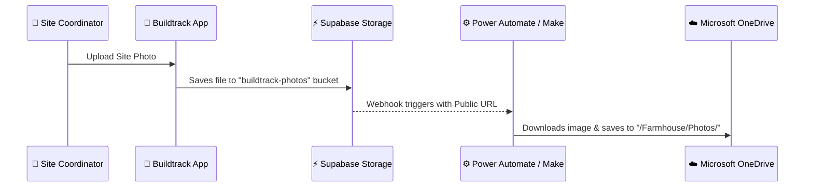

# ☁️ OneDrive Integration Guide: Linking All Uploads

This guide provides two production-ready strategies to automatically sync or upload all photos from **Buildtrack** directly to your **Microsoft OneDrive** folder.

---

## 📈 Method A: The Webhook Sync (Easiest & Most Robust)

**Time to set up:** 5 Minutes  
**No Code Maintenance:** 100% cloud-managed  
**Best for:** Production reliability, zero database token overhead, and instant backups.

In this approach, files are uploaded to Supabase Storage as normal. A Supabase Database Webhook automatically detects the new upload and triggers a cloud automation tool (**Make.com**, **Microsoft Power Automate**, or **Zapier**) to push the photo to your OneDrive.

### Step-by-Step Setup:



1. **Create an Automation Webhook:**
   * Go to **Power Automate** (included in your Office/Microsoft 365 subscription) or **Make.com**.
   * Create a new Flow/Scenario triggered by a **Webhook (JSON Payload HTTP POST)**.
   * Note down the generated webhook URL (e.g., `https://hook.make.com/...` or `https://prod-....azurewebsites.net/...`).

2. **Enable Supabase Webhook:**
   * Go to your **Supabase Dashboard** -> **Database** -> **Webhooks**.
   * Create a new Webhook:
     * **Name:** `sync_photos_to_onedrive`
     * **Table:** `objects` (inside the `storage` schema)
     * **Events:** `INSERT`
     * **Target:** HTTP POST
     * **URL:** Paste your Automation Webhook URL.

3. **Configure the Flow Action:**
   * Set up the next action in your automation tool: **OneDrive -> Upload File from URL**.
   * Map the **File URL** field to the public URL in the Supabase webhook payload:
     `https://your-project.supabase.co/storage/v1/object/public/buildtrack-photos/{{bucket_path}}`
   * Set the destination folder to `/Farmhouse Construction/Site Photos/`.

---

## 💻 Method B: Programmatic Custom API Upload

**Time to set up:** 30-45 Minutes  
**Code Maintenance:** Managed in Next.js  
**Best for:** Fully custom client experiences, white-labeled corporate drives, and custom file organization.

In this approach, we create a secure Next.js Route Handler (`/api/backup/onedrive`) that authenticates with your Microsoft Developer Application and saves the files via the **Microsoft Graph API**.

### 1. Register Your App in Microsoft Azure Console:
1. Open the [Azure App Registrations Portal](https://portal.azure.com/#view/Microsoft_AAD_RegisteredApps/ApplicationsListBlade).
2. Register a new app (e.g., `Buildtrack-Backup`).
3. Under **API Permissions**, add:
   * `Files.ReadWrite.All` (To upload files to your OneDrive).
4. Generate a **Client Secret** and copy your **Client ID** and **Tenant ID**.

### 2. Environment Variables (`.env.local`):
```bash
MICROSOFT_CLIENT_ID="your-client-id"
MICROSOFT_CLIENT_SECRET="your-client-secret"
MICROSOFT_TENANT_ID="common" # or your specific tenant ID
ONEDRIVE_REFRESH_TOKEN="your-permanent-refresh-token"
```

### 3. Programmatic Upload Helper (`/lib/onedrive.ts`):
Here is the clean Next.js service to fetch an access token and upload a file directly to your OneDrive:

```typescript
import { Buffer } from "buffer";

async function getAccessToken() {
  const params = new URLSearchParams({
    client_id: process.env.MICROSOFT_CLIENT_ID!,
    client_secret: process.env.MICROSOFT_CLIENT_SECRET!,
    refresh_token: process.env.ONEDRIVE_REFRESH_TOKEN!,
    grant_type: "refresh_token",
  });

  const response = await fetch(`https://login.microsoftonline.com/${process.env.MICROSOFT_TENANT_ID}/oauth2/v2.0/token`, {
    method: "POST",
    headers: { "Content-Type": "application/x-www-form-urlencoded" },
    body: params.toString(),
  });

  const data = await response.json();
  return data.access_token;
}

export async function uploadToOneDrive(fileBuffer: Buffer, fileName: string, folderPath: string = "Farmhouse/Photos") {
  const token = await getAccessToken();
  
  // Microsoft Graph API Endpoint for simple file uploads (up to 4MB)
  const uploadUrl = `https://graph.microsoft.com/v1.0/me/drive/root:/${folderPath}/${fileName}:/content`;

  const response = await fetch(uploadUrl, {
    method: "PUT",
    headers: {
      Authorization: `Bearer ${token}`,
      "Content-Type": "application/octet-stream",
    },
    body: fileBuffer,
  });

  if (!response.ok) {
    const err = await response.json();
    throw new Error(`OneDrive upload failed: ${JSON.stringify(err)}`);
  }

  return await response.json();
}
```

### 4. Integrating with Daily Logs Form:
When a site log is saved, we fetch the file Buffer and call `uploadToOneDrive` alongside the Supabase upload:

```typescript
import { uploadToOneDrive } from "@/lib/onedrive";

// Inside Daily Log submission endpoint:
const fileBuffer = await file.arrayBuffer();
await uploadToOneDrive(Buffer.from(fileBuffer), file.name);
```

---

## ⚖️ Recommendation: Which one should you choose?

| Criteria | 📈 Method A: Webhook Sync | 💻 Method B: Programmatic API |
| :--- | :--- | :--- |
| **Complexity** | 🟢 Extremely Low (No Code) | 🟡 Medium (Requires Azure App Portal setup) |
| **Maintenance** | 🟢 None (Managed by Microsoft/Supabase) | 🟡 High (Token expirations, SDK upgrades) |
| **Speed** | ⚡ Real-Time (Post-Upload) | ⚡ Synchronous (During Upload) |
| **Cost** | 🟢 100% Free (Using standard M365 account) | 🟢 100% Free (No-cost Microsoft APIs) |

> [!TIP]
> **Our recommendation is Method A (Power Automate / Make.com Webhook).** 
> If you already have **Office 365**, Microsoft Power Automate is fully included in your license. Setting this up takes less than 5 minutes and runs completely on Microsoft's servers—leaving your Next.js application fast, clean, and perfectly lightweight!
